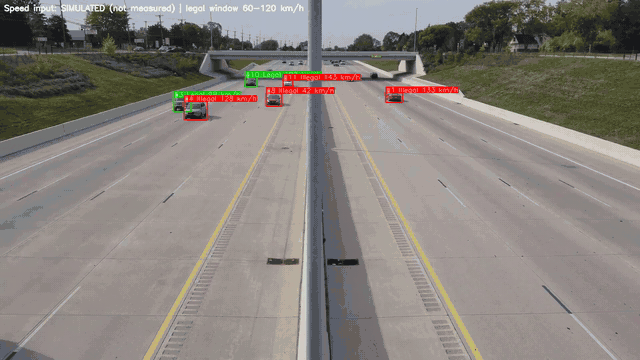

# YOLOv5 Traffic Speed-Violation Demo

Detects vehicles in video with **YOLOv5**, follows each one with a small **IoU tracker**, and
labels it **Legal** (green) or **Illegal** (red) against a speed window (default 60–120 km/h).

> **The speed input is simulated.** Nothing in this repository measures speed from the video.
> `SimulatedSpeed` stands in for a roadside speed sensor so the detection → tracking →
> decision → annotation pipeline can be run end to end. Every output frame says so.
> Measuring speed from the camera itself is the subject of follow-up work (see *Roadmap*).



<sub>Demo footage: third-party highway clip from YouTube (https://youtu.be/eO19UTm93GQ), no licence stated by the uploader; used here only to illustrate the pipeline. Every frame carries the SIMULATED banner.</sub>

## How it works

```
video frame ──► YOLOv5s (COCO) ──► keep car / motorcycle / bus / truck
            ──► IoU tracker: same vehicle keeps the same ID across frames
            ──► get_speed(track_id, box, frame, fps)   ← SIMULATED by default
            ──► Legal if min_speed ≤ speed ≤ max_speed, else Illegal
            ──► boxes + labels drawn, annotated video written
```

- **Detector** — YOLOv5s with the official Ultralytics v6.1 COCO weights (no fine-tuning).
- **Tracker** (`tracker.py`) — greedy IoU matching, a track is confirmed after 2 hits and
  dropped after 15 missed frames. No motion model, so IDs can swap when vehicles cross closely.
- **Speed source** — `SimulatedSpeed` gives each vehicle ID one base speed drawn uniformly from
  40–150 km/h plus ±3 km/h jitter, seeded for reproducibility. Any callable with the signature
  `get_speed(track_id, box, frame_index, fps) -> km/h` can replace it (a sensor feed, or a
  camera-based estimator).

## Quick start

```bash
git clone --recursive https://github.com/Moustafa-Afara/yolov5-traffic-violation-demo.git
cd yolov5-traffic-violation-demo
pip install -r requirements.txt
python speed_violation_demo.py --source path/to/traffic.mp4          # writes output.mp4
python speed_violation_demo.py --source 0 --view --output ""         # webcam, live window
```

The weights (`yolov5s.pt`, 14 MB) download automatically on first run from the Ultralytics
v6.1 release. Useful options: `--min-speed`, `--max-speed`, `--conf`, `--device cpu|0`,
`--max-frames`, `--seed`. Already cloned without `--recursive`? Run `git submodule update --init`.

Tested 2026-09-27 with Python 3.11, PyTorch 2.14 (CPU), OpenCV 4.13.

## What is in this repository

| Path | What it is |
|---|---|
| `speed_violation_demo.py` | The application: detection, tracking, speed hook, labelling, video output |
| `tracker.py` | The IoU tracker |
| `yolov5/` | Ultralytics YOLOv5 as a git submodule, **pinned to commit `724d5b2` (24 June 2022)** — unmodified |
| `CHANGES.md` | Exactly what this project adds to upstream YOLOv5, and its history |
| `assets/demo.gif` | 6-second demo of the annotated output |

## Limitations

- Speed is simulated; the Legal/Illegal labels therefore carry no information about real traffic.
- COCO-pretrained detector, not tuned for traffic cameras; small distant vehicles are missed.
- Simple IoU tracking: identity switches in dense traffic, occlusion, or at low frame rates.
- No accuracy figure is reported because nothing here is evaluated against ground truth.

## Roadmap

The next step is replacing the simulated input with **speed estimated from the camera**: track a
vehicle's image displacement over time and convert pixels to metres using a road-plane
calibration or known object sizes, evaluated against ground-truth speeds on a public benchmark.
That estimator plugs in through `get_speed()` without changing the rest of the pipeline.

## Background

First built in 2022 as the applied chapter of the author's Arabic book draft on machine-learning
and deep-learning algorithms for computer vision
(*«الوصف الدقيق لخوارزميات التعلم الآلي والعميق وتطبيقها في الرؤية الحاسوبية»*), then
restructured in 2026: upstream code separated out, a tracker added, and the simulated speed
input made explicit. See `CHANGES.md`.

## Licence and credits

- **GPL-3.0** (see `LICENSE`). This project imports and builds on Ultralytics YOLOv5, which was
  released under GPL-3.0 at the pinned commit, so the combined work is distributed under GPL-3.0.
- YOLOv5 © Ultralytics — https://github.com/ultralytics/yolov5
- Detector weights: `yolov5s.pt`, Ultralytics release v6.1, trained on COCO.

**Author:** Moustafa Afara — signal processing and pattern recognition (audio, biosignals, vision).
